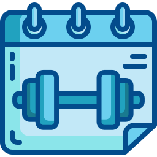

<p align="center">
    
</p>

<p align="center">
<a href="https://www.dio.me/users/luanwp" title="Curriculum"></a>
<a href="https://www.linkedin.com/in/luan-mercaldi-88080890/" title="Profile"></a>
<a href="https://chatgpt.com/" title="Powered by ChatGpt">
  
</a>
</p>

<p align="center">
  <h3 align="center">🤖 Personal Trainer Virtual</h3>
    
Bem-vindo ao **Personal Trainer Virtual!** Esse bot foi desenvolvido como parte de um **desafio de Prompt Engineer** e vai ajudar você a criar treinos personalizados com base nas suas respostas a algumas perguntas rápidas e simples. Vamos nessa? 💪
</p>

---

## 📋 Índice

- [📋 Índice](#-índice)
- [🚀 O que o Bot Faz?](#-O-que-o-Bot-Faz)
- [💪 Biotipos Corporais](#-biotipos-corporais)
- [🏋️ Tipos de Exercícios](#️-tipos-de-exercícios)
- [📅 Dias Disponíveis para Treino](#-dias-disponíveis-para-treino)
- [💡 Como Funciona?](#-Como-Funciona)
- [🔄 Como Atualizar as Preferências?](#-Como-Atualizar-as-Preferências)
- [📊 Benefícios](#-Benefícios)
- [📸 Exemplos Visuais](#-Exemplos-Visuais)
- [⚠️ Importante](#-Importante:-Procure-um-Profissional-Qualificado!)
- [📖 Material de Apoio](#-material-de-apoio)
- [👨‍💻 Expert](#-Expert)

---

## 🚀 O que o Bot Faz?

O **Personal Trainer Virtual** gera um plano de treino totalmente customizado para você, considerando seu biotipo, preferências de exercício e quantos dias por semana você pode treinar. Tudo isso em poucos passos! 🏋️‍♂️

Este projeto tem como objetivo criar um **prompt que auxilia a montar o treino ideal** para cada combinação de fatores, como:

- **Biotipo Corporal**: Ectomorfo, Mesomorfo, Endomorfo, ou indefinido.
- **Disponibilidade de Tempo**: Quantos dias por semana você pode treinar.
- **Tipo de Exercícios Preferidos**: Funcional, Maquinário, Peso Livre, Cardio, HIIT.

O assistente de personal trainer gerado por esse prompt será capaz de personalizar os treinos de acordo com as características e necessidades do usuário, utilizando as **melhores práticas de Prompt Engineering**.


Combinando tecnologia e conhecimento em fitness, esse bot vai facilitar a criação do **treino ideal** para cada usuário, ajudando-o a atingir seus objetivos de forma eficaz e personalizada.

---

## 💪 Biotipos Corporais

A primeira regra para personalizar o treino é determinar o biotipo corporal do usuário. Existem três biotipos principais:

<table>
  <tr>
    <th>Imagem</th>
    <th>Biotipo</th>
    <th>Descrição</th>
  </tr>
  <tr>
    <td style="text-align: center;">
      
    </td>
    <td><strong>Ectomorfo</strong></td>
    <td>Corpo mais magro, difícil ganhar peso e massa muscular.</td>
  </tr>
  <tr>
    <td style="text-align: center;">
      
    </td>
    <td><strong>Mesomorfo</strong></td>
    <td>Corpo naturalmente musculoso, facilidade para ganhar massa muscular e perder gordura.</td>
  </tr>
  <tr>
    <td style="text-align: center;">
      
    </td>
    <td><strong>Endomorfo</strong></td>
    <td>Corpo com tendência a acumular gordura, maior dificuldade em perder peso.</td>
  </tr>
  <tr>
    <td style="text-align: center;">
      
    </td>
    <td><strong>Não sei, me ajude!</strong></td>
    <td>Não tem problema, dá uma olhada neste vídeo [aqui](www.youtube.com/watch?v=UTHHEOqJIaU) que vai te ajudar a entender melhor. 🎥
</td>
  </tr>
</table>

> **Nota:** Escolha o biotipo que mais se aproxima do seu corpo atual para que o treino seja mais eficiente.

---

## 🏋️ Tipos de Exercícios

A Segunda regra envolve a escolha do tipo de exercício preferido. Aqui estão algumas categorias com exemplos:

| **Imagem**                                                       | **Tipo de Treino** | **Descrição**                                                                                                 |
| ---------------------------------------------------------------- | ------------------ | ------------------------------------------------------------------------------------------------------------- |
|  | **Funcional**      | Treinos com movimentos naturais, que trabalham o corpo todo de forma equilibrada.                                |
|   | **Maquinário**     | Você curte aparelhos de academia? Então essa é a opção ideal.                                          |
|      | **Peso Livre**     | Se você prefere treinar com halteres e barras, essa é a escolha. |
|    | **Cardio**         | Gosta de correr, pedalar ou fazer exercícios de resistência? Cardio é para você!                     |
|      | **HIIT**           | Quer treinos curtos e intensos para queimar gordura? O HIIT vai te desafiar! 🔥                                      |

---

## 📅 Dias Disponíveis para Treino

A Terceira regra é determinar quantos dias por semana o usuário tem disponível para treinar. Dependendo do número de dias, o treino sugerido pode variar:

| **Imagem**                                                     | **Dias por Semana** | **Tipo de Treino Sugerido** |
| -------------------------------------------------------------- | ------------------- | --------------------------- |
|  | 1 dia               | Treino Full Body            |
|  | 3 dias              | Treino ABC                  |
|  | 5 dias              | Treino ABCDE                |

- **Full Body**: O bot vai sugerir um treino Full Body, ou seja, para o corpo inteiro em uma única sessão.
- **ABC**: Você vai receber um treino ABC, que divide os grupos musculares em três dias.
- **ABCDE**: Aqui o treino é mais avançado, com um plano ABCDE, onde cada dia tem um foco específico.

---

## 💡 Como Funciona?

1. **Você Responde Algumas Perguntas:**

   - O bot vai perguntar sobre o seu tipo de corpo, o tipo de treino que você prefere e quantos dias você tem disponível para treinar.
   - Exemplo de perguntas:
     - Qual é o seu biotipo corporal?
     - Você prefere treinar com pesos livres, máquinas, ou prefere cardio?
     - Quantos dias por semana você pode treinar?
    
2. **Lembre-se de Incluir Sua Base de Conhecimento:**

   - Antes de iniciar o processo, certifique-se de que o bot tenha acesso ao arquivo (abra [AQUI!](https://github.com/LuanMercaldi/-Criando-um-Personal-Trainer-IA-com-Boas-Praticas-de-Prompt-Engineer/raw/main/.github/assets/Base_de_Conhecimento.txt)) que contém todas as informações para definir qual será a melhor opção de treino para você.
   - Clique com o botão direito, em seguinda "salvar página como", escolha o local desejado para salvar o arquivo e clique em salvar.
   - Anexe o arquivo baixado no seu LLM favorito
   - Insira também o seguinte prompt para guiar o bot no seu treino:

   ```plaintext
   Baseado nessa base de conhecimento, quero que você aja como o personal trainer, não quero que dê sugestões de respostas, quero que use as perguntas pra me avaliar e em seguida defina qual o melhor treino.

3. **O Bot Gera um Treino Personalizado:**

   - Com base nas suas respostas, o bot monta um plano de treino, com dicas sobre séries, repetições e intensidade. Tudo feito sob medida! 🎯

5. **Você Treina e Acompanha seu Progresso:**

   - Agora é só seguir o plano, marcar os dias de treino, e ver os resultados! 🔥

---

## 🔄 Como Atualizar as Preferências

Se você quiser mudar o tipo de treino ou a quantidade de dias disponíveis, é só resetar o bot e responder novamente às perguntas. Ele ajusta tudo rapidinho para você. 😉

Para entender como o bot toma decisões, consulte a **[Base de Conhecimento](https://github.com/LuanMercaldi/-Criando-um-Personal-Trainer-IA-com-Boas-Praticas-de-Prompt-Engineer/raw/main/.github/assets/Base_de_Conhecimento.txt)**. Se quiser alterar a base, basta baixar o arquivo de texto, fazer as mudanças necessárias e subir o arquivo atualizado no ChatGPT. Pronto, seu bot estará com as novas informações personalizadas! 🛠️


---

## 📊 Benefícios

- **Personalização Total**: Seu treino vai ser 100% baseado nas suas respostas.
- **Simples e Rápido**: Sem complicações, você define tudo em poucos minutos.
- **Adapta-se ao seu Tempo**: Quer treinar 1, 3, 5 dias? O bot se ajusta à sua agenda.

---

## 📸 Exemplos Visuais

Aqui está um exemplo de como você verá as perguntas na interface do bot:


*Na tela acima, você pode escolher o seu biotipo corporal.*


*Nessa tela, você pode selecionar o seu exercício favorito.*


*Aqui, você pode definir quantos dias na semana pode treinar.*


*Então o BOT define o melhor treino pra você.*

---

## ⚠️ Importante: Procure um Profissional Qualificado!

Embora o **Personal Trainer Virtual** ofereça planos de treino personalizados, ele não substitui a orientação de um profissional qualificado. Cada pessoa tem necessidades e limitações específicas que devem ser acompanhadas por um especialista. 💡

Sempre que possível, **consulte um educador físico ou personal trainer** para garantir que os exercícios e as cargas estão adequados ao seu corpo e seus objetivos. O uso de Inteligência Artificial pode ser um grande suporte, mas a supervisão de um profissional é essencial para evitar lesões e maximizar resultados! 🏋️‍♂️

---

Esperamos que você aproveite o máximo desse bot e que ele te ajude a alcançar seus objetivos de treino! Se precisar de alguma coisa, estamos por aqui. 😄👊

---

## 📖 Material de Apoio

Aqui estão alguns recursos adicionais que podem ser úteis para entender melhor o projeto e as práticas de prompt engineering:

- [Fundamentos de Engenharia de prompt](https://elidianaandrade.gitbook.io/fundamentos-de-engenharia-de-prompts-com-claude-3)
- [Boas práticas de prompt](https://aline-antunes.gitbook.io/otimize-seus-prompts-e-aprenda-mais-usando-ias-1)

---

## 👨‍💻 Expert

<p>
    
    <p>&nbsp&nbsp&nbspLuan Mercaldi<br>
    &nbsp&nbsp&nbsp
    <a href="https://www.dio.me/users/luanwp">
    DIO</a>&nbsp;|&nbsp;
    <a href="https://www.linkedin.com/in/luan-mercaldi-88080890/">LinkedIn</a>
</p>
<br/><br/>
<p>

---

⌨️ com 💜 por [Luan Mercaldi](https://github.com/LuanMercaldi)

